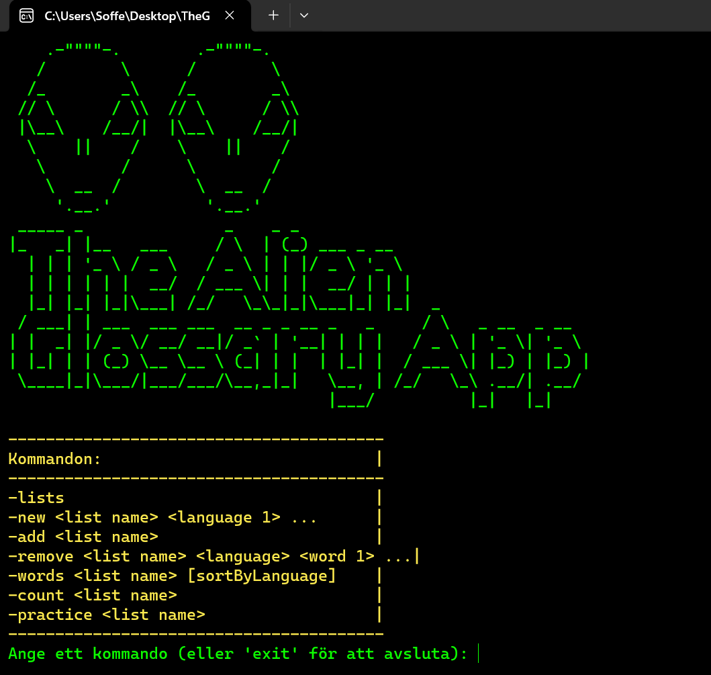

<a name="readme-top"></a>
[![Contributors][contributors-shield]][contributors-url]
[![Forks][forks-shield]][forks-url]
[![Stargazers][stars-shield]][stars-url]
[![Issues][issues-shield]][issues-url]
[![MIT License][license-shield]][license-url]
[![LinkedIn][linkedin-shield]][linkedin-url]


<!-- PROJECT LOGO -->
<br />
<div align="center">
  <a href="https://github.com/github_username/AlienGlossary_Lab3">
    
  </a>

<h3 align="center">Alien Glossary App</h3>

  <p align="center"> This app, crafted in C# and .NET, is a versatile application comprising three key components: <p> Class Library, Console Application, WinForms GUI<p>  The Class Library acts as the core, housing the essential logic and functionalities used across the application. The Console Application offers a straightforward, command-line interface for efficient interaction and is mirrored by the WinForms GUI, which provides a graphical counterpart for a more intuitive user experience. Both the console and WinForms interfaces enable seamless access and management of the glossary, catering to different user preferences and workflows.
    <br />
    <a href="https://github.com/sofianesso/AlienGlossary_Lab3"><strong>Explore the docs »</strong></a>
    <br />
    <br />
    <a href="https://github.com/sofianesso/AlienGlossary_Lab3">View Demo</a>
    ·
    <a href="https://github.com/sofianesso/AlienGlossary_Lab3/issues">Report Bug</a>
    ·
    <a href="https://github.com/sofianesso/AlienGlossary_Lab3/issues">Request Feature</a>
  </p>
</div>


<!-- TABLE OF CONTENTS -->
<details>
  <summary>Table of Contents</summary>
  <ol>
    <li>
      <a href="#about-the-project">About The Project</a>
      <ul>
        <li><a href="#built-with">Built With</a></li>
      </ul>
    </li>
    <li>
      <a href="#getting-started">Getting Started</a>
      <ul>
        <li><a href="#prerequisites">Prerequisites</a></li>
        <li><a href="#installation">Installation</a></li>
      </ul>
    </li>
    <li><a href="#contributing">Contributing</a></li>
    <li><a href="#license">License</a></li>
    <li><a href="#contact">Contact</a></li>
  </ol>
</details>


<!-- ABOUT THE PROJECT -->
## About The Project

[![Product Name Screen Shot][product-screenshot]](https://example.com)

<p align="right">(<a href="#readme-top">back to top</a>)</p>


### Built With

* [![Csharp][Csharp.com][Csharp-url]
* [![Bootstrap][Bootstrap.com]][Bootstrap-url]

<p align="right">(<a href="#readme-top">back to top</a>)</p>


<!-- GETTING STARTED -->
## Getting Started


To get a local copy up and running follow these simple example steps.


### Prerequisites

* .NET Framework
* C# Environment
* Windows Operating System
* Command Line Interface

### Installation

 1. Open Your Terminal/Command Prompt
* You can use Command Prompt or PowerShell
   
2. Clone the Repository
* Use the following command to clone the Alien Glossary App repository to your local machine
   ```sh
   git clone https://github.com/sofianesso/AlienGlossary_Lab3.git
   ```
   
3. Navigate to the Console App Directory
* Change your current directory to the Console App within the cloned repository
   ```sh
   
   cd AlienGlossary_Lab3/consoleapp
   ```
   
* Replace AlienGlossary_Lab3 with the actual name of the root directory if it is different.
   
4. Run the Console App
   ```sh
   dotnet run
   ```
5.  Launch the WinForms App, navigate to the WinForms directory
  ```sh
    cd AlienGlossary_Lab3/winformsapp
   ```

* Run the WinForms App
*  ```sh
    dotnet run
   ```

<p align="right">(<a href="#readme-top">back to top</a>)</p>


<!-- CONTRIBUTING -->
## Contributing

Contributions are what make the open source community such an amazing place to learn, inspire, and create. Any contributions you make are **greatly appreciated**.

If you have a suggestion that would make this better, please fork the repo and create a pull request. You can also simply open an issue with the tag "enhancement".
Don't forget to give the project a star! Thanks again!

1. Fork the Project
2. Create your Feature Branch (`git checkout -b feature/AmazingFeature`)
3. Commit your Changes (`git commit -m 'Add some AmazingFeature'`)
4. Push to the Branch (`git push origin feature/AmazingFeature`)
5. Open a Pull Request

<p align="right">(<a href="#readme-top">back to top</a>)</p>


<!-- LICENSE -->
## License

Distributed under the MIT License. See `LICENSE.txt` for more information.

<p align="right">(<a href="#readme-top">back to top</a>)</p>


<!-- CONTACT -->
## Contact


Project Link: [https://github.com/sofianesso/AlienGlossary_Lab3](https://github.com/sofianesso/AlienGlossary_Lab3)

<p align="right">(<a href="#readme-top">back to top</a>)</p>


<p align="right">(<a href="#readme-top">back to top</a>)</p>


<!-- MARKDOWN LINKS & IMAGES -->
<!-- https://www.markdownguide.org/basic-syntax/#reference-style-links -->
[contributors-shield]: https://img.shields.io/github/contributors/sofianesso/AlienGlossary_Lab3.svg?style=for-the-badge
[contributors-url]: https://github.com/sofianesso/AlienGlossary_Lab3/graphs/contributors
[forks-shield]: https://img.shields.io/github/forks/sofianesso/AlienGlossary_Lab3.svg?style=for-the-badge
[forks-url]: https://github.com/sofianesso/AlienGlossary_Lab3/network/members
[stars-shield]: https://img.shields.io/github/stars/sofianesso/AlienGlossary_Lab3.svg?style=for-the-badge
[stars-url]: https://github.com/sofianesso/AlienGlossary_Lab3/stargazers
[issues-shield]: https://img.shields.io/github/issues/sofianesso/AlienGlossary_Lab3.svg?style=for-the-badge
[issues-url]: https://github.com/sofianesso/AlienGlossary_Lab3/issues
[license-shield]: https://img.shields.io/github/license/sofianesso/AlienGlossary_Lab3.svg?style=for-the-badge
[license-url]: https://github.com/sofianesso/AlienGlossary_Lab3/blob/master/LICENSE.txt
[linkedin-shield]: https://img.shields.io/badge/-LinkedIn-black.svg?style=for-the-badge&logo=linkedin&colorB=555
[linkedin-url]: https://linkedin.com/in/sofian_essounani
<!-- MARKDOWN LINKS & IMAGES -->
[product-screenshot]: demo/aliengui.png
<!-- MARKDOWN LINKS & IMAGES -->

[Csharp.com]: https://img.shields.io/badge/Csharp%20--path?style=for-the-badge&logo=C%23&labelColor=%23512BD4&color=%23512BD4
[Csharp-url]: https://dotnet.microsoft.com/
[Bootstrap.com]: https://img.shields.io/badge/Bootstrap-563D7C?style=for-the-badge&logo=bootstrap&logoColor=white
[Bootstrap-url]: https://getbootstrap.com

